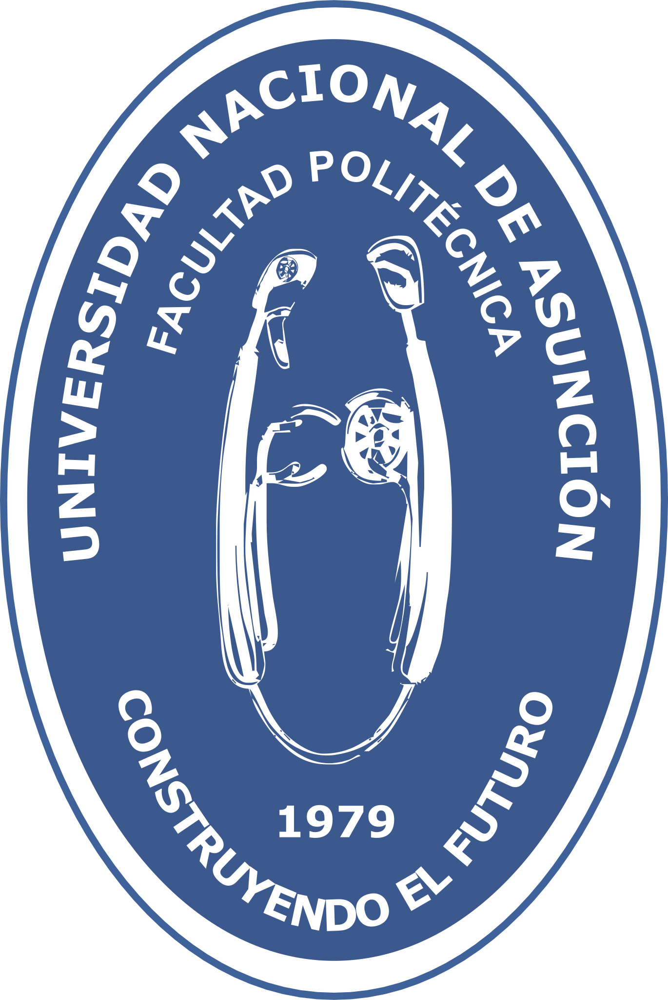

## Where I've Studied

### Bachelor's Degree in Computer Science at FP-UNA

{:height="50px" width="50px"}

I am currently pursuing my degree in Computer Science (Ingeniero Informático) at Facultad Politécnica. Here, I have honed my skills in programming languages like Java, JavaScript, Dart, Flutter, and C. 

#### Courses and Certifications
> _Add details about specific courses, certifications, or workshops you've attended or completed._

#### Projects
> _Brief about any significant projects you undertook during this time._

#### Events and Activities
During my time at FP-UNA, I've participated in:

- Competitive Programming
- Hackathons
- Volunteer programs with IEEE

---

### Computer Science at Colegio Técnico Vocacional Carlos Antonio Lopez

{:height="50px" width="50px"}

My foundational knowledge in computer science began at Colegio Técnico Vocacional Carlos Antonio Lopez. Here, I was introduced to the world of IT, learning essential skills from basic IT solutions to computer repair. 

#### Courses and Certifications
> _Add details about specific courses or certifications you've achieved._

#### Projects
> _Details about any projects or assignments that were significant during this period._

---

## Additional Trainings and Workshops

> _Include details about any additional trainings, workshops, or seminars you've attended outside of your formal education._

---

## Skills and Expertise

> _List down specific skills, tools, or technologies you're proficient in._

---
